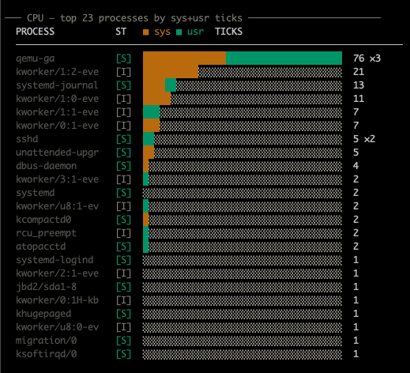
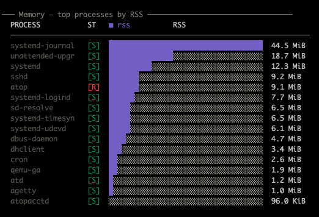
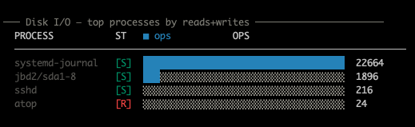
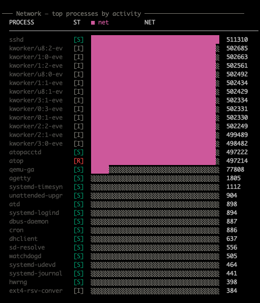
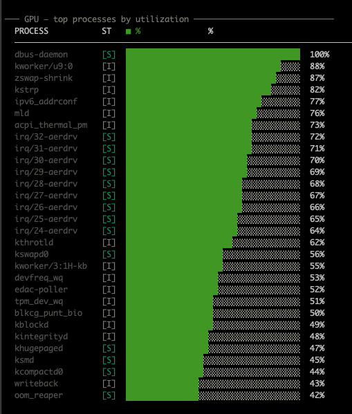
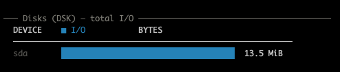
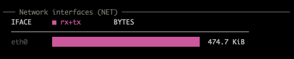

# Metrics

`atop-flame` parses every label that `atop -P` emits and decides per-section
whether to render based on whether the corresponding data is present in the
input stream. Below is the full label catalog, with screenshots from the
test corpus (`test/data/output_full.raw`).

## Per-process — top-N by resource

### CPU (`PRC`)

Stacked horizontal bar: **amber** = sys-mode ticks, **teal** = usr-mode ticks.
Sum across all threads per process name. The `×N` suffix on the value
column counts merged threads.



Process-state tag in `[ ]`:

- `[R]` running — red
- `[D]` uninterruptible I/O — amber
- `[S]` sleeping — teal
- `[I]` idle kernel thread — gray

### Memory / RSS (`PRM`)

**Violet** = resident set size. Max value observed across snapshots
(threads share memory, so summing would over-count).



### Disk I/O (`PRD`)

**Blue** = combined disk operations (reads + writes). Summed across
snapshots. Requires the atop kernel patch or `atopacctd` — otherwise the
column reads zero and the section is skipped.



### Network (`PRN`)

**Pink** = aggregate network activity (per-process net stats). Requires
kernel patch — frequently unavailable, in which case the section is omitted.



### GPU (`PRG`)

**Green** = GPU utilization (max observed). Rendered only when the system
has GPUs that atop can see.



## Devices

### Disks (`DSK`)

Total bytes transferred per block device (`sda`, `nvme0n1`, …). Sectors
converted to bytes assuming the conventional 512 B sector size.



### Logical volumes (`LVM`) and MD RAID (`MDD`)

Same layout as `DSK`, scoped to the matching device class. Sections are
rendered only when the input contains the corresponding label.

### Network interfaces (`NET`)

**Pink** = combined rx + tx bytes per interface (`eth0`, `wlan0`, …).
atop's aggregated `upper` / `network` rollup lines are dropped so they don't
overshadow real interfaces.



### InfiniBand (`IFB`)

Same layout as `NET`, scoped to IB ports.

## System summary

Singleton lines collapsed into one compact block at the end:

```text
CPU       sys: 0.0%  usr: 0.0%  wait: 0.0%  idle: 99.9%  (cores: 4)
load      1m: 0.00  5m: 0.00  15m: 0.00   ctxsw: 48953  intr: 37772
memory    used: 103.8 MiB / 7.6 GiB   cache: 1.5 GiB   buffer: 76.4 MiB   slab: 124.1 MiB
swap      used: 0 B / 0 B   committed: 113.1 MiB
paging    swapin: 0  swapout: 0  stalls: 0
pressure  cpu: 0.0%  mem: 0.0%  io: 0.0%  (10s avg)
snapshots 1
```

Each row comes from one atop label:

| Row | Label | Source field |
|---|---|---|
| `CPU` | `CPU` | sys / usr / wait / idle ticks |
| `per-core` | `cpu` | per-core busy % (when present) |
| `load` | `CPL` | load1 / load5 / load15, ctx switches, interrupts |
| `memory` | `MEM` | total, free, cache, buffer, slab (pages × pagesize) |
| `swap` | `SWP` | total, free, committed |
| `paging` | `PAG` | swapin, swapout, stalls |
| `pressure` | `PSI` | cpu/mem/io "some" 10 s averages — kernel ≥ 4.20 with `CONFIG_PSI=y` |
| `NFS` | `NFS` / `NFSC` / `NFSS` | client/server activity flag |

## Aggregation rules

| Label | How values merge across snapshots |
|---|---|
| `PRC` | **sum** sys/usr ticks; count threads |
| `PRM` | **max** of RSS / VSize / swap (threads share memory) |
| `PRD` | **sum** read + write operations |
| `PRN` | **sum** numeric fields (atop layout varies) |
| `PRG` | **max** GPU % |
| `DSK` / `LVM` / `MDD` | **sum** ms-busy, sectors |
| `NET` / `IFB` | **sum** packets, bytes |
| `CPU` / `CPL` / `MEM` / `SWP` / `PAG` / `PSI` | **most recent** snapshot wins |

Process state is the *most active* observed across threads, ranked
`R > D > S > I`.

## What's not rendered

- Sections without data are simply skipped. A snapshot with only `PRC` / `PRM`
  / `PRD` and no `NET` will produce three process charts plus the system
  summary; the network device section never appears.
- Atop's per-thread `PRC` rows are merged by process name. To inspect
  individual PIDs, read the raw `atop -P` dump directly.
- Multi-snapshot inputs are flattened into a single aggregate view. There is
  no time-series chart yet.
